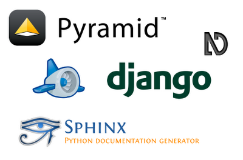

============================================
 PyCon JP 2012 参加者募集のお知らせ的な何か
============================================

お前、誰よ
==========

- `@shomah4a <http://twitter.com/shomah4a>`_
- PyCon JP 2012 広報担当
- Java の会社で Java を dis るだけの簡単なお仕事
- クラスタとか

  - #kabepy #pyhack #pyconjp #pypyja

  
PyCon JP とは
=============

.. s6:: styles

    h2: {fontSize:'150%', textAlign:'center', margin:'30% auto', background: '#ffffff', color: '#000000'}

Python 使いによる Python 使いのためのカンファレンス
===================================================

.. s6:: styles

    h2: {fontSize:'100%', textAlign:'center', margin:'30% auto', background: '#ffffff', color: '#000000'}

PyCon JP 2012 開催概要
======================

- 日程

  - カンファレンス: 9/15(土), 16(日)
  - Sprint: 9/17(月・祝)

- 場所: `産業技術大学院大学 <http://aiit.ac.jp/>`_
- マルチトラック(英語トラック含む)・コミュニティトラック・ハンズオン・オープンスペース
- http://2012.pycon.jp/

.. s6:: styles

   ul: {fontSize: '70%'}

基調講演
========

.. s6:: styles

    h2: {fontSize:'130%', textAlign:'center', margin:'30% auto', background: '#ffffff', color: '#000000'}

@mitsuhiko
==========

.. figure:: _static/mitsuhiko.*
   :width: 35%
   :target: http://twitter.com/mitsuhiko

.. s6:: styles

    div: {margin:'5% auto', textAlign: 'center'},

@dankogai
=========

.. figure:: _static/dankogai.*
   :width: 60%
   :target: http://twitter.com/dankogai

.. s6:: styles

    div: {margin:'10% auto', textAlign: 'center'},

併設イベント
============

- `App Engine Conference 2012 <https://sites.google.com/site/appengineconference2012/>`_
- `Django & Pyramid Con JP 2012 <http://djangoproject.jp/weblog/2012/07/26/django_pyramid_con_jp/>`_
- `NVDA Workshop in Japan <http://workshop.nvda.jp/>`_
- `SphinxCon JP 2012 <http://sphinx-users.jp/event/20120916_sphinxconjp/index.html>`_

.. s6:: styles

    div: {marginLeft: '5%', width: '40%'},

申し込みについて
================

- 参加登録ページから

  - http://2012.pycon.jp/registration/index.html

- PyCon JP

  - http://connpass.com/event/708/
  - 参加費 3000円

- PyCon JP Party
  
  - http://connpass.com/event/709/
  - 参加費 5500円

.. s6:: styles

   ul: {fontSize: '70%'}

申し込みについて
================

- クレジットカード持ってないんだけど

  - 2012@pycon.jp までメールでお問い合わせください

- 参加したいけど遠くて…

  - `遠方参加者支援制度 <http://2012.pycon.jp/registration/support.html>`_ を設けました。

    ページをよく読んだ上でご応募ください。

.. s6:: styles

   ul: {fontSize: '70%'}

注意
====

- Paypal の支払いで問題が発生中
- 住所確認しないと支払えないみたい

  - Adaptive Payments API と Express Checkout API の違いとかなんとか

- バグっぽいらしい
- Zusaar でも同様の問題が発生

  - connpass & Zusaar で組んで Paypal に文句を言うらしい

.. s6:: styles

   ul: {fontSize: '70%'}

回避策
======

- Paypal に **登録していない** クレジットカードでログインせずに支払う
- PyCon JP 運営に個別問い合わせ

.. s6:: styles

    li: {fontSize:'100%', textAlign:'center', margin:'30% auto', background: '#ffffff', color: '#000000'}

PyCon JP 2012 でお待ちしております!
===================================

.. s6:: styles

    h2: {fontSize:'130%', textAlign:'center', margin:'30% auto', background: '#ffffff', color: '#000000'}

#kabepy もよろしくね!
=====================

.. figure:: _static/kabepy.*
   :width: 80%

.. s6:: styles

   div: {margin: '5% auto', textAlign: 'center'},

